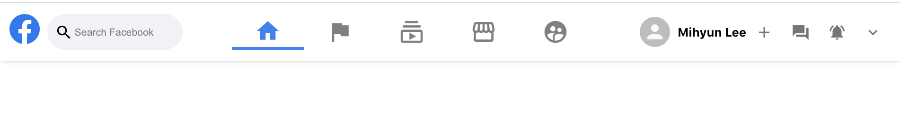
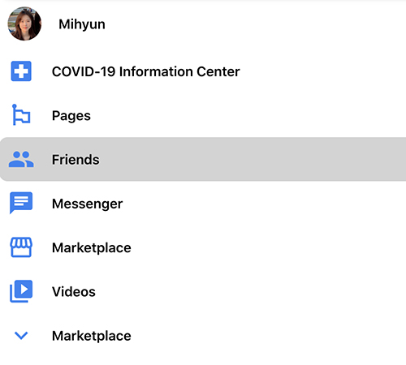
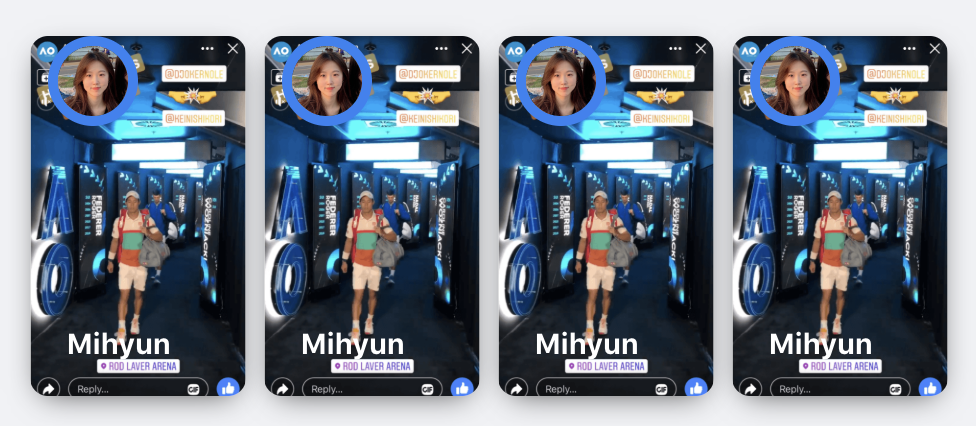
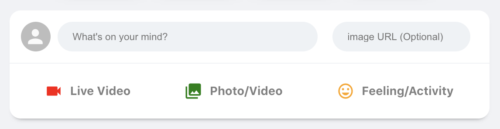
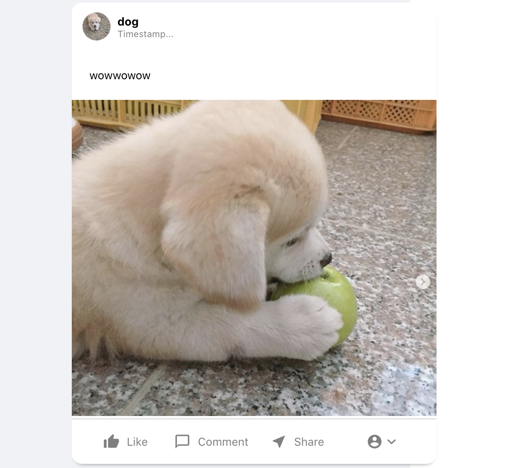
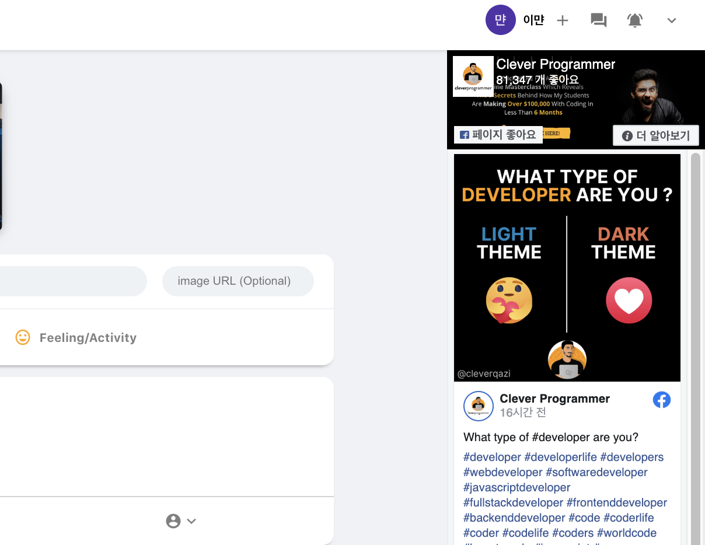
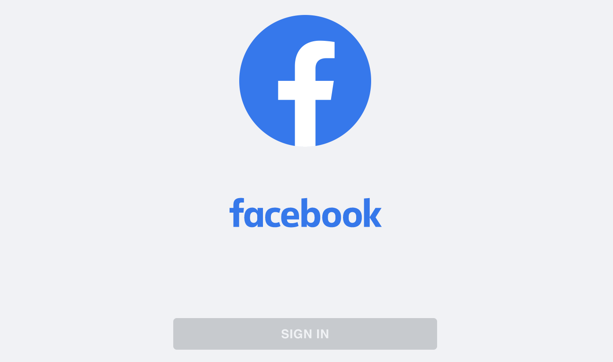
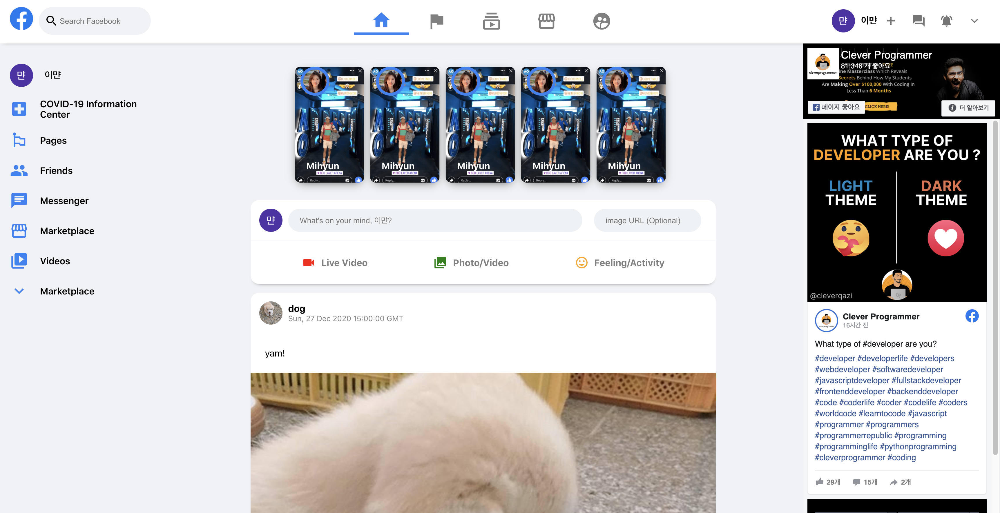

# ✨ facebook clone with React ✨

**Tutorial Link** 👉 [https://youtu.be/B-kxUMHBxNo](https://youtu.be/B-kxUMHBxNo)

### day1: make Header

### day2: make Sidebar

### day3: make Story feed

### day4: make Message Sender

### day5: make Feed

### day6: make Widgets

### day7: authentication and firebase deploy! 🚀

**deploy link** 👉 [https://facebook-clone-fb235.web.app](https://facebook-clone-fb235.web.app/)

